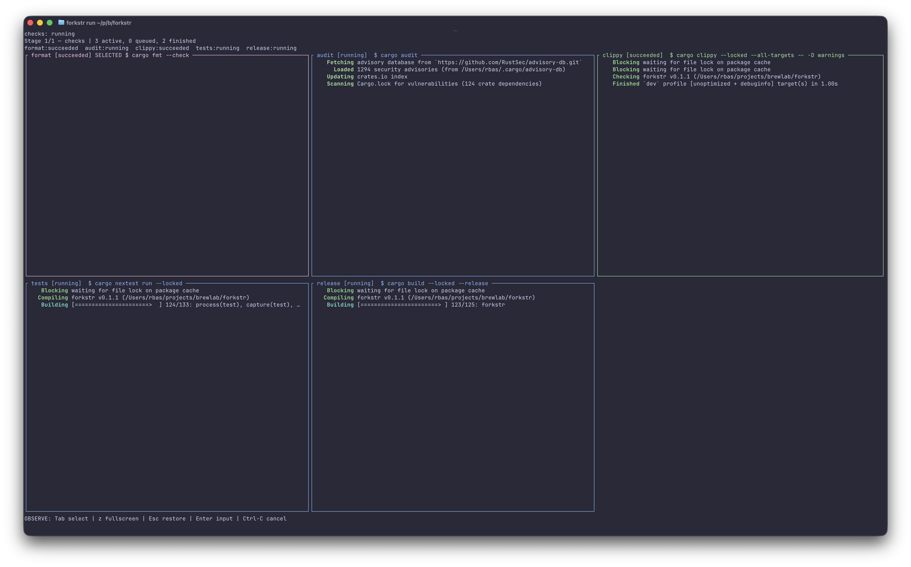

# Forkstr

**Your quality gate should not be a queue.**

Do you run formatting, linting, tests, security checks, and a release build before
you push? Do you run them one after another because parallel shell output becomes
an unreadable mess?

Forkstr runs independent commands at the same time and gives each one its own
live terminal pane. You see what is running, inspect each output stream, send
input when a command needs it, and get one clear result at the end.



```text
format ─────┐
lint ───────┤
tests ──────┼──▶ package
audit ──────┘
  stage 1          stage 2
```

Commands inside a **stage** run in parallel. The next stage starts only after
the current one succeeds. That is the whole model: group work that can overlap,
and use a new stage only where you need a barrier.

## Try it

Install the latest pre-built binary on Linux or macOS:

```sh
curl --proto '=https' --tlsv1.2 -LsSf https://raw.githubusercontent.com/rbas/forkstr/main/install.sh | sh
```

The [installer](install.sh) detects the platform, downloads the latest release,
verifies its SHA-256 checksum, and installs it in `/usr/local/bin` (using `sudo`
only when necessary). Set `FORKSTR_INSTALL_DIR` to choose another directory. The
[GitHub Releases](https://github.com/rbas/forkstr/releases) page provides archives
and checksums for manual installation.

Create `forkstr.toml` in your project:

```toml
version = 1

[[stages]]
name = "quality"
commands = [
  { name = "format", run = "npm run format:check" },
  { name = "lint",   run = "npm run lint" },
  { name = "tests",  run = "npm test" },
  { name = "audit",  run = "npm audit" },
]

[[stages]]
name = "package"
commands = [
  { name = "release", run = "npm run build" },
]
```

The same configuration is available as
[examples/javascript-quality.toml](examples/javascript-quality.toml).

Then validate and run it:

```sh
forkstr validate
forkstr run
```

Here, all four quality checks start together. The release build starts only when
all four finish successfully. If one fails, Forkstr shows which command failed
and preserves the output instead of burying it in interleaved logs.

## Real parallelism, not parallel waiting

Some commands look independent but contend for the same resource: a test
database, fixed port, browser, device, generated directory, or shared build
cache. Forkstr gives you two ways to model that honestly:

- Give conflicting commands the same `resources = ["test-database"]` value and
  Forkstr will run them one at a time while unrelated commands keep moving.
- Configure isolated databases, caches, working directories, or output paths so
  work can genuinely overlap when that isolation is safe.

This repository uses isolated build directories in [forkstr.toml](forkstr.toml),
but Forkstr itself is language-agnostic. It runs shell commands; the right stages
and resources depend on your project. Measure both approaches—the fastest design
depends on the workload, machine, and cache state.

## Why Forkstr instead of `command & command & wait`?

- Live panes keep concurrent output readable.
- Stages express the ordering that actually matters.
- Named resources prevent collisions around ports, databases, devices, or build
  directories without serializing unrelated work.
- Fail-fast and finish-stage policies make failure behavior explicit.
- Process-group cleanup stops child processes too when you cancel a run.
- Complete raw output, event metadata, and readable transcripts are retained.

Forkstr is a single Rust binary for macOS and Linux. It is deliberately smaller
than a build system and more structured than a shell script.

## Bring Forkstr to your coding agent

The binary includes a language-agnostic skill that teaches AI coding agents how
to discover a project's real commands, create or revise `forkstr.toml`, model
stages and resources, validate the pipeline, and help a human operate the UI.
Export it to a new directory:

```sh
forkstr skill export ./forkstr-skills
```

Review the exported files, then import the complete `using-forkstr` folder using
your agent's native skill workflow. Exporting never changes agent configuration
and refuses to overwrite an existing destination.

## Working on Forkstr

Install [just](https://github.com/casey/just),
[cargo-nextest](https://nexte.st/),
[cargo-audit](https://github.com/rustsec/rustsec/tree/main/cargo-audit), and
[convco](https://convco.github.io/).

```sh
forkstr run       # parallel quality gate with live output
just check        # equivalent checks, run serially
just release      # bump, commit, and tag from Conventional Commits
```

See the [changelog](CHANGELOG.md), [roadmap](docs/roadmap.md), and
[technical requirements](docs/technical-requirements.md) for deeper detail. The
bundled, shareable agent guidance lives in the
[Forkstr skill](skills/using-forkstr/SKILL.md).
